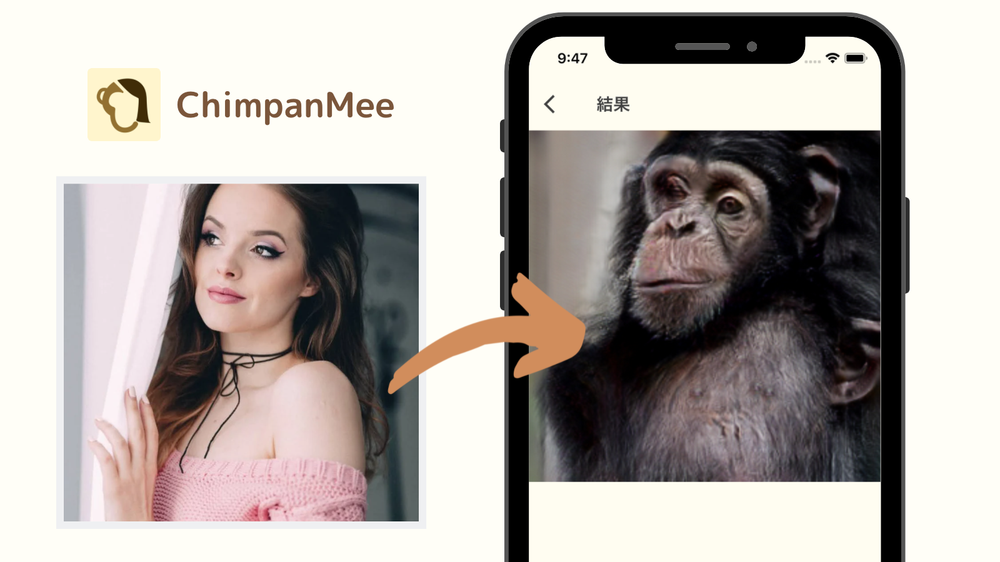

# ChimpanMee

The Flutter app ChimpanMee transforms human's face into chimpanzee-like one by generative AI called UGATIT which one type of GAN. The app is available for iOS and Android.

**Download**  
iOS: https://apps.apple.com/jp/app/chimpanmee/id1619592086  
Android: https://play.google.com/store/apps/details?id=com.doryan.chimpanmee

## Feature
It's so simple.
1. Choose a photo of someone's face from gallary or take a photo of new one.
2. Confirm the chosen photo and start transforming it into a chimpanzee.
3. Waiting for a few seconds, you may see the result.

## Main Points
- AI (UGATIT) can work only on-device. No Internet is needed.
- Uses [the original Flutter plugin](https://github.com/ryu38/flutter-ML-imageTransformation) for on-device image generation.
- The app uses Riverpod for state management.

## Details
GAN including UGATIT can transform one image to another while preserving structual features of original one. For example, Horse -> Zebra, Human -> Anime Character and so on. To make UGATIT able to transform human's face into chimpanzee's one, I trained UGATIT by giving a specific number of human and chimpanzee images.

It was trained on PyTorch and converted into CoreML for iOS and Pytorch Mobile for Android, which are AI frameworks for each platform.

To use the trained UGATIT model in Flutter without internet, I created the Flutter plugin below.  
[flutter_ml_image_transformation](https://github.com/ryu38/flutter-ML-imageTransformation)

